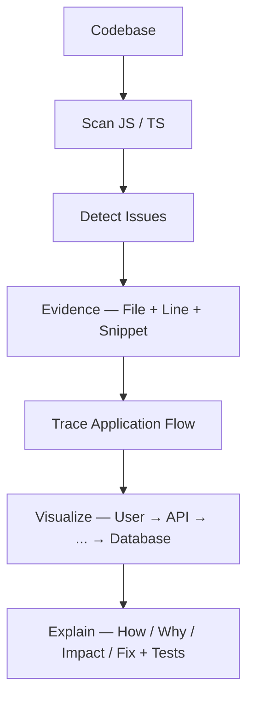
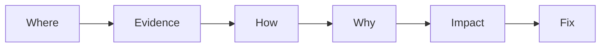
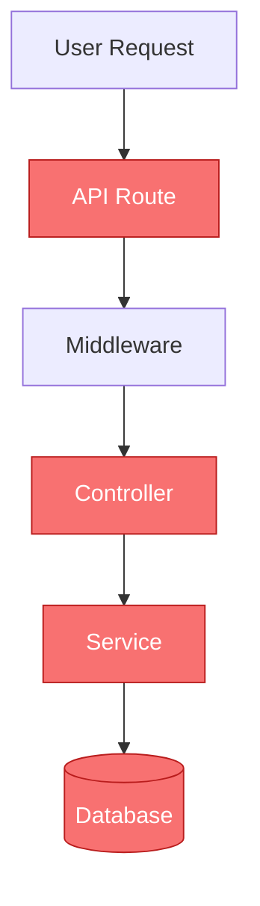
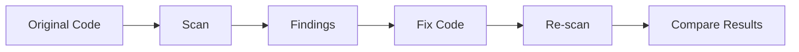
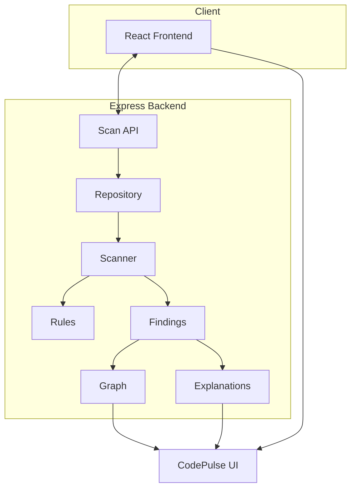
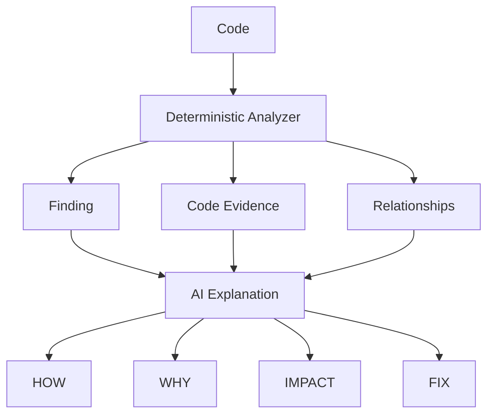

<div align="center">

# ⚡ CodePulse

**Understand your code. Find the problem. Trace the impact.**

An application issue explorer that scans JavaScript/TypeScript codebases, connects findings to real application flow, and explains *why* they matter — not just that they exist.

Built for the **IBM Bob 2.0 Hackathon** · [Development history →](./bob_sessions)

[](#tech-stack)
[](#tech-stack)
[](#tech-stack)
[](#testing)

</div>

---

## 📚 Table of Contents

- [The Problem](#-the-problem)
- [The CodePulse Approach](#-the-codepulse-approach)
- [Features](#-features)
- [Detection Rules](#-detection-rules)
- [Grounded Issue Exploration](#-grounded-issue-exploration)
- [Application Impact Graph](#️-application-impact-graph)
- [Dashboard](#-dashboard)
- [Architecture](#️-architecture)
- [AI Layer](#-ai-layer)
- [Getting Started](#️-getting-started)
- [API Reference](#-api-reference)
- [Demo Workflow](#-demo-workflow)
- [Testing](#-testing)
- [Project Structure](#-project-structure)
- [Roadmap](#-roadmap)

---

## 🎯 The Problem

Finding a warning is usually where the real work *starts*, not ends. A developer still has to manually chase down:

- Where exactly does the problem originate?
- What code pattern triggered it?
- How can it propagate through the application?
- Which components are affected, and how severe is it?
- What should change, and how do you verify the fix?

Traditional static analysis often produces a long list of disconnected warnings. **CodePulse connects each finding to application context** — turning "a vulnerability was detected" into "here's where it lives, why it matters, and how to fix it."

---

## 💡 The CodePulse Approach



---

## 🚀 Features

### 🔎 Repository Scanning
Recursively scans `.js`, `.jsx`, `.ts`, and `.tsx` files, automatically skipping `node_modules`, `.git`, `dist`, `build`, `coverage`, and `.bob`. Every finding includes structured evidence: rule ID, category, severity, file, line, code snippet, and description.

### 🐛 Bug & Logic Detection
Flags logic issues such as loose equality:

```js
if (userId == requestedId) { ... }
```
> `LOGIC-001` · Bugs & Logic · Medium — Loose equality (`==`) used instead of strict equality (`===`).

### ⚠️ Error Handling Analysis
Identifies async Express route handlers using `await` without a surrounding `try/catch`:

```js
router.get('/users', async (req, res) => {
  const users = await getUsers();
  res.json(users);
});
```

### 🔐 Security Analysis
Detects common risky patterns, including:

| Pattern | Example |
|---|---|
| Hardcoded secrets | `const jwtSecret = "mysupersecretkey";` |
| SQL injection via concatenation | `"SELECT * FROM users WHERE name = '" + username + "'"` |
| Client-controlled authorization | `const { isAdmin } = req.body; if (isAdmin) { ... }` |
| Unsanitized request data | Request-controlled values flowing into responses/rendering |

### ⚡ Performance Analysis
Flags N+1 query patterns and synchronous filesystem calls:

```js
for (const order of orders) {
  const user = await getUserForOrder(order.userId); // PERF-001
}
```
```js
fs.readFileSync(...)   // SYNC-001
fs.writeFileSync(...)
```

---

## 📋 Detection Rules

CodePulse ships with **9 focused, evidence-based rules** — prioritizing high-confidence detections over broad, noisy coverage.

| Rule | Category | Severity | Detection |
|---|---|---:|---|
| `LOGIC-001` | Bugs & Logic | Medium | Loose `==` equality |
| `ERR-001` | Error Handling | High | Async route without error handling |
| `SEC-001` | Security | High | Hardcoded secrets/API keys |
| `SEC-002` | Security | High | SQL string concatenation |
| `API-001` | API & Data Flow | High | Client-supplied `isAdmin` |
| `PERF-001` | Performance | Medium | DB call inside a loop |
| `LOG-001` | Bugs & Logic | Low | Production `console.log` |
| `SYNC-001` | Performance | Low | Synchronous filesystem calls |
| `INPUT-001` | Security | Low | Direct request input in response/render |

---

## 🧠 Grounded Issue Exploration

Every finding can be explored through six layers:



| Layer | What it shows |
|---|---|
| **Where** | File, line, rule ID |
| **Evidence** | The exact code snippet that triggered the detector |
| **How** | How the pattern can occur within the application flow |
| **Why** | Why the pattern is problematic |
| **Impact** | Application components associated with the finding |
| **Fix** | Remediation guidance and suggested verification tests |

---

## 🕸️ Application Impact Graph

CodePulse visualizes where a finding sits within the app's request lifecycle:



> **Note:** This graph reflects a deterministic mapping from the detected rule and file location — an application-flow *model*, not a full runtime call graph.

Additional visualization modes in **Graph View**:
- **Application Flow** — request-to-database path
- **Findings by Category** — breakdown across categories
- **Findings by Severity** — high vs. medium vs. low
- **Findings by File** — treemap of finding distribution

---

## 📊 Dashboard

A single-glance overview of the scan: health score, severity breakdown, findings by category, before/after comparison, and an exportable Markdown report.

```text
┌───────────────────────────────────────────┐
│              ISSUE SUMMARY                 │
│               HEALTH SCORE                 │
│                    72                      │
│  TOTAL       HIGH      MEDIUM      LOW     │
│    12          4          5          3     │
├───────────────────────────────────────────┤
│ Security          5 findings               │
│ Bugs & Logic      2 findings               │
│ Error Handling    2 findings               │
│ API & Data Flow   1 finding                │
│ Performance       2 findings               │
└───────────────────────────────────────────┘
```

### 🔬 Issue Explorer
Grouped by category, filterable by severity (`ALL · HIGH · MEDIUM · LOW`), with evidence snippets, explanations, impact, fix recommendations, and verification tests. Resolved findings in the fixed project are marked **✓ Fixed**.

### 📈 Before / After Analysis
Paired sample projects (`*-project` / `*-project-fixed`) demonstrate the full loop:



---

## 🏗️ Architecture



**Backend pipeline:**
```text
Repository → File Collection → JS/TS Scanner → Detection Rules
→ Structured Findings → Graph Builder → Explanations → REST API
```

The scanner is deliberately decoupled from the presentation layer, keeping the analyzer independently testable.

---

## 🤖 AI Layer

Core principle: **deterministic analysis provides evidence; AI provides understanding.**



**Current status:** `server/ai/index.js` is the designated AI layer but is currently a **placeholder**. Demo explanations are pre-generated and stored in `server/data/explanations.json`, keyed to specific findings. This separation lets a future LLM/agent implementation consume analyzer output while keeping detection itself grounded in deterministic evidence.

> **Design principle:** *Do not confuse detection with proof.* A `DETECTED` pattern ("a suspicious code pattern exists") is not the same as an `INFERRED` conclusion ("this may create a security risk under a particular execution path"). Static analysis can't always prove runtime behavior — CodePulse's analyzer supplies the evidence, and the explanation layer adds interpretation on top.

---

## ⚙️ Getting Started

### Prerequisites
- Node.js
- npm
- Git

### 1. Clone the repository
```bash
git clone https://github.com/priyanshu2734/codepulse.git
cd codepulse
```

### 2. Start the backend
```bash
cd server
npm install
npm run dev
```
Runs at **http://localhost:3001**

### 3. Start the frontend
```bash
cd client
npm install
npm run dev
```
Runs at **http://localhost:5173** — API requests to `/api` are proxied automatically to the backend.

---

## 🔌 API Reference

### List available projects
```http
GET /api/projects
```
```json
[
  { "key": "ecommerce", "label": "sample-ecommerce-api" },
  { "key": "blog", "label": "sample-blog-api" },
  { "key": "auth", "label": "sample-auth-service" }
]
```

### Scan a project
```http
GET /api/scan?target=ecommerce&project=before
```

| Parameter | Values | Description |
|---|---|---|
| `target` | `ecommerce`, `blog`, `auth` | Sample project to scan |
| `project` | `before`, `after` | Original or fixed version |

```json
{
  "findings": [],
  "graph": {},
  "explanations": {},
  "project": "before",
  "target": "ecommerce"
}
```

---

## 🔄 Demo Workflow

1. **Open the dashboard** — start the frontend and visit `http://localhost:5173`
2. **Select a project** — choose one of the included sample apps
3. **Scan** — CodePulse analyzes the project and generates findings
4. **Inspect an issue** — open **Issue Explorer** and step through Where → Evidence → How → Why → Impact → Fix
5. **Visualize the impact** — open **Graph View** to see highlighted flow nodes for the selected finding
6. **Compare the fix** — toggle **Before → After**; resolved findings show **✓ Fixed**
7. **Export** — download a Markdown report from the dashboard

### Example: API-001 in action
```js
router.post('/orders', (req, res) => {
  const { userId, items, isAdmin } = req.body;
  if (isAdmin) {
    // privileged operation
  }
});
```
CodePulse traces `isAdmin` → `req.body` → access-control decision, flags it as `API-001` (High), and highlights the affected `API Route → Controller → Service` chain — with an explanation of the privilege-escalation risk and remediation guidance.

---

## 🧪 Testing

```bash
cd server
npm test
```

Coverage includes positive detections, negative/counterexample cases, full repository scanning, required finding fields, and `node_modules` exclusion — e.g.:

```js
test('SEC-001 does NOT fire when value references process.env', ...)
test('SEC-002 does NOT fire on parameterised queries', ...)
```

This ensures rules flag genuine patterns rather than every superficially similar line.

---

## 🛠️ Tech Stack

| Layer | Technologies |
|---|---|
| **Frontend** | React 18, React Router, Vite, JavaScript, CSS, SVG-based visualization |
| **Backend** | Node.js, Express.js, CORS, REST API |
| **Analysis** | Custom JS/TS scanner, pattern-based rules, deterministic flow mapping |
| **Testing** | Jest |
| **Development** | IBM Bob 2.0, Git, GitHub |

---

## 📁 Project Structure

```text
CodePulse/
├── .bob/                       # Bob IDE rules and configuration
├── bob_sessions/                # Phase-by-phase dev notes & screenshots
├── client/
│   └── src/
│       ├── components/          # CommandPalette, ComparisonChart, HealthScore, ...
│       ├── context/ScanContext.jsx
│       ├── pages/                # Dashboard, GraphView, IssueExplorer
│       └── App.jsx
├── server/
│   ├── ai/index.js               # AI explanation layer (placeholder)
│   ├── analyzer/                 # index.js, rules.js, scanner.js
│   ├── data/explanations.json
│   ├── graph/index.js
│   ├── routes/scan.js
│   └── tests/analyzer.test.js
├── sample-project(-fixed)/
├── sample-blog-project(-fixed)/
├── sample-auth-project(-fixed)/
├── AGENTS.md
├── blueprint.md
└── README.md
```

---

## 🔮 Roadmap

- **Real AI integration** — replace the placeholder explanation layer with an LLM/agent that consumes findings + evidence + relationships to generate grounded How/Why/Impact/Fix explanations
- **Deeper code understanding** — AST-based analysis, better data-flow tracking, cross-file dependency analysis, more precise call graphs
- **Expanded security analysis** — authN/authZ flow analysis, dependency vulnerabilities, sensitive-data flow, more injection patterns
- **Automated verification** — generated unit, integration, regression, and security tests
- **Workflow integration** — GitHub/GitLab, pull requests, CI/CD, pre-commit hooks
- **AI-assisted remediation** — review → apply patch → run tests → re-scan, end to end

---

<div align="center">

### ⚡ CodePulse
**Find the issue. Understand the evidence. Trace the impact. Fix with confidence.**

Built for the **IBM Bob 2.0 Hackathon** · [github.com/priyanshu2734/codepulse](https://github.com/priyanshu2734/codepulse)

</div>
